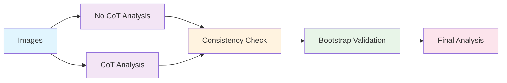

# News Analysis Pipeline Documentation

## Overview
This pipeline implements a comprehensive analysis of protest images using Vision Language Models (VLMs) with multiple validation and analysis stages. The workflow progresses from data collection through consistency validation to final statistical analysis with bootstrap methods.

## Script Execution Order

### 1. Data Collection Phase

#### `vlm_news_analysis_none_cot.py` - No Chain-of-Thought Analysis
**Purpose**: Initial image analysis without Chain-of-Thought reasoning
- **Input**: Folder of protest images
- **Output**: CSV with binary classifications (conflict, peace, protester solidarity, police solidarity)
- **Models Supported**: Ollama, OpenAI, vLLM
- **Key Features**: 
  - Binary classification without reasoning chains
  - Faster processing for initial data collection
  - Command-line interface with progress tracking

**Example Usage**:
```bash
python vlm_news_analysis_none_cot.py --image-folder ./images --api ollama --model gemma3:27b-it-q8_0 --output-csv results.csv
```

#### `vlm_news_analysis_cot.py` - Chain-of-Thought Analysis
**Purpose**: Enhanced analysis with Chain-of-Thought reasoning
- **Input**: Same image folder
- **Output**: Enhanced CSV with reasoning chains and confidence scores
- **Key Features**:
  - Three reasoning depths: simple, detailed, expert
  - Resume capability for interrupted runs
  - Enhanced prompt engineering
  - Timeout handling for long-running analyses
  - Sample size control for testing

**Example Usage**:
```bash
python vlm_news_analysis_cot.py --image-folder ./images --api ollama --model gemma3:27b-it-q8_0 --use-cot --cot-depth detailed --output-csv enhanced_results.csv
```

### 2. Consistency Validation Phase

#### `run_consistency_analysis_validation.py` - Run Consistency Analysis
**Purpose**: Assess reliability between multiple runs of the same model
- **Input**: Multiple run outputs from previous scripts
- **Output**: Consistency metrics and reliability assessment
- **Key Metrics**:
  - Krippendorff's Alpha
  - Cohen's Kappa
  - Intraclass Correlation Coefficient (ICC)
  - Three-way agreement statistics
  - Pairwise consistency measures
- **Models Analyzed**: 5 models (gemma3_27b_it_q8_0, gpt_4_1, internvl3_14b, internvl3_38b, qwen2_5)
- **Prompt Levels**: 4 levels (baseline, simple, detailed, expert)
- **Runs**: 3 runs per model-prompt combination

**Example Usage**:
```bash
python run_consistency_analysis_validation.py
```
**Configuration**: Update `data_folder` and `gt_file` paths in the script

### 3. Performance Validation Phase

#### `run_bootstrap_analysis_validation.py` - Bootstrap Performance Analysis
**Purpose**: Validate model performance using bootstrap resampling with comprehensive statistical analysis
- **Input**: Consistency-validated data from previous phase
- **Output**: Bootstrap confidence intervals and statistical significance
- **Key Features**:
  - Bootstrap resampling (default: 2000 iterations)
  - Multiple metrics: Pearson correlation, MCC, F1-score, Balanced Accuracy, Cohen's Kappa
  - Confidence interval calculation (95% CI)
  - Statistical significance testing with appropriate baselines
  - Cross-run stability analysis
  - Model comparison with FDR correction
  - Comprehensive visualization suite
- **Core Goals Addressed**:
  1. Quantify uncertainty in performance metrics
  2. Demonstrate robustness across runs and models
  3. Support claims of statistical significance
  4. Compare metrics across models with precision

**Example Usage**:
```bash
python run_bootstrap_analysis_validation.py
```
**Configuration**: Update `data_folder` and `gt_file` paths in the script

### 4. Final Analysis Phase

#### `run_advanced_analysis_bootstrap_for_all_data.py` - Comprehensive Statistical Analysis
**Purpose**: Final comprehensive analysis using bootstrap methods for publication-ready results
- **Input**: All validated data from previous phases
- **Output**: Publication-ready statistical results
- **Key Features**:
  - Logistic regression with bootstrap (1000 iterations)
  - Random forest with bootstrap (1000 iterations)
  - Feature importance analysis with confidence intervals
  - Odds ratios and confidence intervals
  - Statistical significance testing
  - Comprehensive binary feature analysis (70+ features)
  - Automated result saving and reporting

**Example Usage**:
```bash
python run_advanced_analysis_bootstrap_for_all_data.py path/to/data.csv output_directory
```

## Data Flow Architecture



## Prerequisites

- Python 3.8+
- Required packages: pandas, numpy, scikit-learn, matplotlib, seaborn, scipy
- Optional: pingouin (for ICC calculations)
- API access: Ollama, OpenAI, or vLLM server
- Image folder with protest images

## Installation

```bash
# Install required packages
pip install pandas numpy scikit-learn matplotlib seaborn scipy

# Optional: Install pingouin for ICC calculations
pip install pingouin

# Install additional dependencies for specific APIs
pip install openai python-dotenv requests tqdm

# Install consistency analysis dependencies
pip install krippendorff

# Install statistical analysis dependencies
pip install statsmodels
```

## Configuration Notes

- Update file paths in each script before execution
- Ensure API services are running (Ollama, vLLM)
- Set appropriate environment variables (OPENAI_API_KEY)
- Adjust bootstrap iterations based on computational resources (default: 2000)
- Configure model names and prompt levels in analysis scripts

## API Setup

### Ollama
```bash
# Start Ollama service
ollama serve

# Pull required model
ollama pull gemma3:27b-it-q8_0
```

### vLLM
```bash
# Start vLLM server
TOKENIZERS_PARALLELISM=false CUDA_VISIBLE_DEVICES=1 vllm serve OpenGVLab/InternVL3-14B --port 8001
```

### OpenAI
```bash
# Set environment variable
export OPENAI_API_KEY="your_api_key_here"
```
## Troubleshooting

### Common Issues

1. **API Connection Errors**: Ensure services are running and accessible
2. **Memory Issues**: Reduce batch size or bootstrap iterations
3. **Timeout Errors**: Increase timeout values for vLLM API calls
4. **File Path Errors**: Verify all paths are correctly configured
5. **Missing Dependencies**: Install pingouin for ICC calculations

### Performance Optimization

- Use GPU acceleration for vLLM when available
- Adjust batch sizes based on available memory
- Consider using smaller models for initial testing
- Implement parallel processing for large datasets
- Reduce bootstrap iterations for faster testing (minimum 1000)

## Contributing

When contributing to this pipeline:
1. Maintain the established execution order
2. Ensure backward compatibility
3. Add appropriate error handling
4. Update documentation for new features
5. Test with sample data before deployment
6. Follow the four core goals framework for bootstrap analysis

## License

MIT License

---

This multi-stage approach ensures robust, publication-ready results with proper statistical validation at each step, addressing reliability, robustness, and statistical significance comprehensively.
